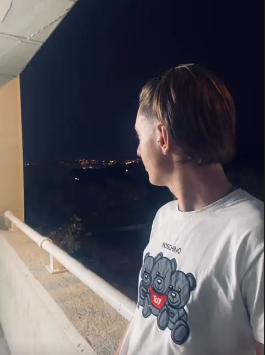

# Creacio-duna-pagina-personal-amb-Markdown2
1. **Introducció**: Em dic Hugo Martinez i m'agrada llegir.
- Dades personals: Hugo Martinez, Badalona (Barcelona).
- Aficionats i interessos: Llegir, jugar a ping-pong, escoltar música i tocar el piano
2. **Educació**: Estic estudiant el CFGM de SMX al *Puig Castellar* i també estudiant per treure'm el títol de C1 d'angles.
- Experiència laboral: No tinc.
- Projectes destacats: Un projecte destacat que vaig començar fa tempa era el de crear la meva propia empresa.
-------------------------------------------------------------------------------
Fa ja tres anys, vaig tenir l'idea de crear una empresa d'arreglar telèfons mòbils, pero vaig tenir que deixar l'idea ja que s'em feia impossible per varies raons: era un nen de 14 anys, no tenia diners i a sobre, estaba estudian alhora.

>Es un projecte que m'agradaria retomar en un futur.
--------------------------------------------------------------------------------
3. **Habilitats**: Tinc l'habilitat de estar sense respirar 3 minuts.
4. **Xarxes socials**: 
Aquesta es una de les fotos que tinc al meu [Instagram](https://www.instagram.com/huugo.martiinez/)



```sing namespace std;
 
int main() {
    int edad = 25;
    double salario = 1500.75;
    char letra = 'X';
    bool esCierto = true;```
